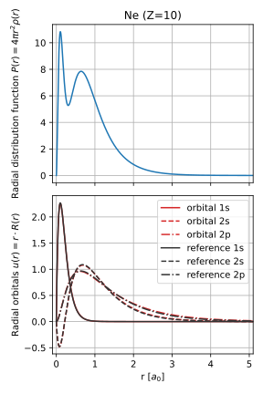

# RadialDFT

This project implements Density Functional Theory (DFT) for an isolated atom in vacuum allowing to obtain e.g. the
electron density and total energy of the system. The goal of this project was for me to get a better understanding of
the theory of DFT and to get more familiar with the Rust programming language. The code works by solving the radially
symmetric Kohn-Sham equations

$$ \left[ -\frac{1}{2} \frac{\mathrm{d}^2}{\mathrm{d}r^2} + \frac{l(l+1)}{2 r^2} + V_\mathrm{eff}(r) \right] u_{nl}(r) = \varepsilon_{nl} u_{nl}(r) $$

using finite differences. It uses atomic units to simplify the equations. Currently only the VWN LDA functional[^1] is
implemented. More information on all the equations the implementation was based on can be found [here](docs/theory.md).

Similar projects for single atoms but not based on finite differences can be found on GitHub[^2][^3].

<div align="center">



**The electron distribution and orbitals for Neon as obtained from the DFT code compared to orbitals from Clementi and Roetti[^4].**

</div>

## Compilation

The sources of the Rust implementation are in the `src` folder. An equivalent implementation in Python using numpy/scipy
can be found in `scripts/dft.py`. It was initially used to test the derived equations. The rust code can be compiled by
running the following command in the root directory of this repo.
````bash
cargo build --release
# optionally run tests (only integration functions and LAPACK wrappers for now)
cargo test
````

The compiled binary is located in the `target/release` folder. The `example.toml` file shows how to configure the
settings. Alternatively command line arguments can be used to quickly get the energies or orbitals for a single Z.
The example will calculate the densities and orbitals for the first 92 elements. A script is provided to plot them.
```bash
# either use command line arguments to get the energies (in this case Z=1)
./target/release/RadialDFT 1
# or run the example configuration (create the output folder first)
mkdir densities
./target/release/RadialDFT -c example.toml
# plot the orbitals for neon (Z=10)
python scripts/plot.py 10
```

The Rust version is only a bit faster than the Python version since scipy makes use of exactly the same LAPACK routines.
On my machine, calculating the energies for the first 92 elements (without saving the densities) takes about 18 seconds
compared to 23 second with the Python version.

## Accuracy

Values from NIST[^5] were used for comparison. The VWN XC functional was chosen as it is also the one used by NIST.
While the finite differences with second-order accuracy make it possible to use a very efficient eigenvalue routine from
LAPACK for tridiagonal matrices, the accuracy is not on par with the other previously mentioned projects. This table
shows the error of the energies in Hartree for the first ten elements of the periodic table. With increasing atomic
number Z, the error also rises. To improve the accuracy, it might be necessary to use higher-order finite differences or
switch to a shooting method like Numerov's method which was employed by the other projects.

|  Z | Element |        Etot |        Ekin |       Ecoul |        Eenuc |          Exc |
|---:|:--------|------------:|------------:|------------:|-------------:|-------------:|
|  1 | H       |  0.00079284 |  0.00079330 | 3.24725e-07 | -1.05807e-06 | -7.27051e-07 |
|  2 | He      | -0.00051835 | -0.00051544 | 2.35062e-06 | -4.18774e-06 | -1.07253e-06 |
|  3 | Li      | -0.00083069 | -0.00082675 | 6.37482e-06 | -8.37773e-06 | -1.94103e-06 |
|  4 | Be      | -0.00298327 | -0.00298721 | 1.27943e-05 | -5.71522e-06 | -3.13824e-06 |
|  5 | B       |  0.00125729 |  0.00122172 | 1.62602e-05 |  2.21060e-05 | -2.79951e-06 |
|  6 | C       | -2.7456e-05 | -0.00013456 | 1.97107e-05 |  8.93771e-05 | -2.98867e-06 |
|  7 | N       |  0.00059191 |  0.00035410 | 2.40241e-05 |   0.00021589 | -2.10138e-06 |
|  8 | O       |  0.00358971 |  0.00313495 | 2.61340e-05 |   0.00042853 |  9.27860e-08 |
|  9 | F       |  0.00295010 |  0.00216475 | 2.96221e-05 |   0.00075410 |  2.62305e-06 |
| 10 | Ne      |  0.00520926 |  0.00394611 | 3.19529e-05 |   0.00122498 |  6.22485e-06 |

[^1]: https://doi.org/10.1139/p80-159
[^2]: https://github.com/certik/dftatom
[^3]: https://github.com/aromanro/DFTAtom
[^4]: https://doi.org/10.1016/S0092-640X(74)80016-1
[^5]: https://www.nist.gov/pml/atomic-reference-data-electronic-structure-calculations/atomic-reference-data-electronic-7
